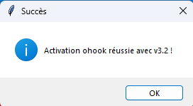
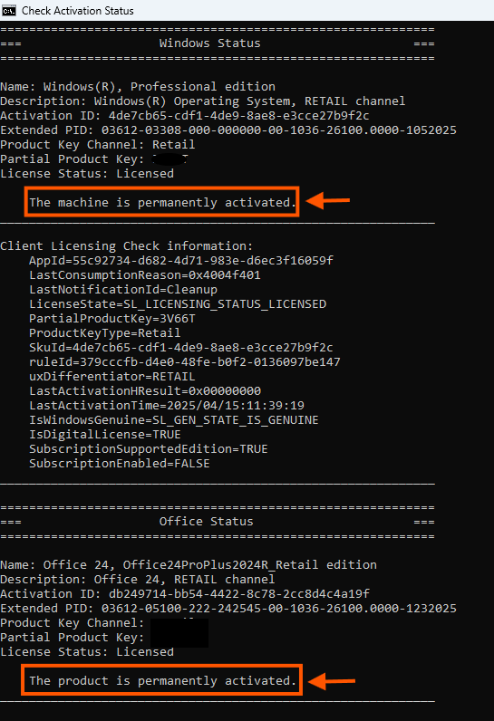

# Scripts d'Activation Microsoft v3.1

## 📋 Introduction
Ce projet fournit une interface graphique (GUI) développée avec Python et Tkinter pour simplifier l'activation de Windows et Microsoft Office. Il utilise le script **Microsoft Activation Scripts (MAS)**, disponible sur [massgrave.dev](https://massgrave.dev), pour effectuer les activations. L'interface propose plusieurs méthodes d'activation (HWID, KMS38, Ohook, etc.) et des outils comme la vérification de l'état d'activation, avec une animation arc-en-ciel en arrière-plan pour une touche visuelle.

## ✨ Fonctionnalités
- **Activation de Windows** : Méthodes HWID, KMS38, IoT Enterprise SK, et mode silencieux.
- **Activation d'Office** : Méthode Ohook.
- **Outils** : Vérification de l'état d'activation de Windows.
- **Animation arc-en-ciel** : Arrière-plan animé qui change de couleur toutes les secondes.
- **Pas de console visible** : Utilise l'extension `.pyw` pour éviter l'affichage de la fenêtre de console sur Windows.

## 🖼️ Captures d'Écran
Les captures d'écran suivantes illustrent l'utilisation du script (voir le dossier `screenshots/`) :

- **Interface principale** :   
- **Message de succès après activation** :   
- **Message d'erreur après échec** :   
- **Vérification de l'état d'activation** : 

## ⚙️ Prérequis
- **Système d'exploitation** : Windows 10/11 (nécessite un environnement graphique).
- **Python** : Version 3.6 ou supérieure, avec les modules suivants :
  - `tkinter` (inclus avec Python).
  - `subprocess`, `time`, `os` (inclus avec Python).
- **PowerShell** : Configuré pour exécuter des scripts. Exécutez cette commande en mode administrateur si nécessaire :
  ```powershell
  Set-ExecutionPolicy -Scope CurrentUser -ExecutionPolicy RemoteSigned

    Connexion Internet : Requise pour télécharger le script MAS depuis https://massgrave.dev/get (sauf si vous utilisez une version locale, voir "Utilisation d'une version locale (.cmd)").

📦 Installation

    Téléchargez et installez Python depuis python.org.
    Clonez ou téléchargez ce projet dans un dossier local :
    bash

    git clone <URL-du-projet>

    Ou téléchargez le ZIP et extrayez-le.
    Assurez-vous que PowerShell est configuré pour exécuter des scripts (voir Prérequis).

🚀 Utilisation

    Lancez le script principal mas_activator.pyw :
    bash

    pythonw mas_activator.pyw

    Remarque : L'extension .pyw empêche l'affichage de la fenêtre de console sur Windows.
    L'interface graphique s'ouvre avec trois sections :
        Activation de Windows : Choisissez une méthode (HWID, KMS38, IoT, Silent).
        Activation d'Office : Utilisez la méthode Ohook.
        Outils : Vérifiez l'état d'activation ou explorez des fonctionnalités futures (comme KMS Offline).
    Cliquez sur un bouton pour lancer une activation. Un message indiquera le succès ou l'échec de l'opération.

🔧 Utilisation d'une version locale (.cmd)
Par défaut, le script télécharge la version PowerShell de MAS depuis https://massgrave.dev/get. Si vous préférez utiliser une version locale pour plus de sécurité :

    Téléchargez le script .cmd (par exemple, All-In-One-Version.cmd) depuis massgrave.dev.
    Placez-le dans le répertoire du projet et renommez-le en MAS.cmd.
    Modifiez la méthode activate dans mas_activator.pyw pour exécuter le fichier local. Exemple :
    python

    if method == "hwid":
        subprocess.run('MAS.cmd /HWID', shell=True)

    Exécutez le script comme d'habitude.

Avantages :

    Pas de dépendance à Internet.
    Contrôle accru sur le script exécuté.

Inconvénients :

    Nécessite un téléchargement manuel.
    Les commandes doivent être adaptées à la syntaxe du .cmd.

📜 Documentation Technique
Pour plus de détails sur le fonctionnement interne, consultez documentation.md.
⚠️ Avertissements

    Sécurité : Exécuter un script téléchargé depuis https://massgrave.dev/get peut présenter des risques. Vérifiez la fiabilité de la source ou utilisez une version locale (voir "Utilisation d'une version locale (.cmd)").
    Légalité : L'activation de Windows/Office via des scripts tiers peut violer les conditions d'utilisation de Microsoft. Utilisez ce script à vos propres risques et respectez les lois locales.
    Fonctionnalité non implémentée : L'option "Activer avec KMS Offline" n'est pas encore disponible.

🐞 Problèmes Connus

    Certaines commandes PowerShell (pour iot, silent, kmsoffline) échouent en raison de paramètres non reconnus. Une mise à jour de la syntaxe est nécessaire.
    Le script nécessite un environnement graphique pour fonctionner.

🤝 Contribuer
Vous souhaitez améliorer ce projet ? Voici quelques idées :

    Corrigez les commandes PowerShell pour qu'elles correspondent à la syntaxe exacte de MAS.
    Ajoutez des fonctionnalités comme une confirmation avant activation.
    Implémentez la fonctionnalité "KMS Offline".
    Soumettez vos pull requests ou signalez des problèmes via GitHub (si hébergé).

📝 Détails Techniques

    Langage : Python 3.
    Interface graphique : Tkinter.
    Commandes PowerShell : Exécutées via subprocess.
    Format : Utilise l'extension .pyw pour éviter l'affichage de la console.

📄 Licence
Ce projet est sous licence MIT. Voir LICENSE pour plus de détails.
🙌 Crédits

    Développé avec Python et Tkinter.
    Utilise le script MAS de massgrave.dev.


#### Changements dans `README.md`
- Mise à jour des références au nom du script (`mas_activator.pyw` au lieu de `script.py`).
- Suppression de la mention de la minimisation de la console (remplacée par une note sur l'extension `.pyw`).
- Mise à jour des instructions d'utilisation pour refléter l'utilisation de `pythonw`
