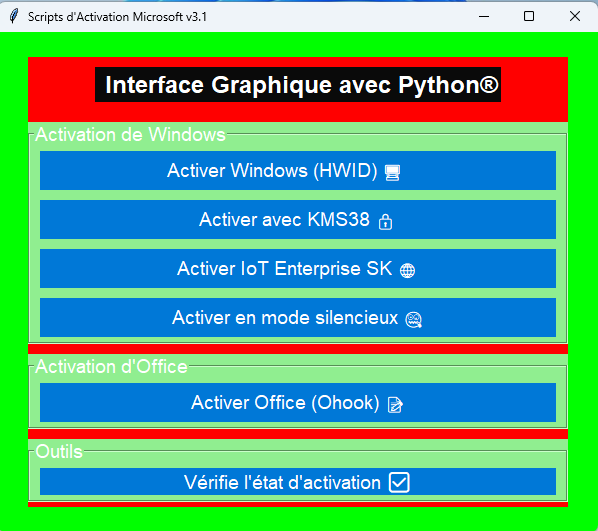

# 📘 Documentation Technique : Scripts d'Activation Microsoft v3.1

           

## 📜 Introduction
Ce document fournit une documentation technique détaillée pour *Scripts d'Activation Microsoft v3.1*, une interface graphique (GUI) développée avec Python et Tkinter. Ce projet simplifie l'activation de Windows et Microsoft Office en utilisant le script **Microsoft Activation Scripts (MAS)**, téléchargé depuis [massgrave.dev](https://massgrave.dev). Il inclut des fonctionnalités d'activation, des outils de vérification, et une animation arc-en-ciel pour l'arrière-plan.

## ⚙️ Aperçu du Projet

### Fonctionnalités Principales
- **Activation de Windows** : Méthodes HWID, KMS38, IoT Enterprise SK, et mode silencieux.
- **Activation d'Office** : Méthode Ohook.
- **Outils** : Vérification de l'état d'activation via `slmgr.vbs`.
- **Animation** : Arrière-plan arc-en-ciel animé.
- **Console** : Minimisation automatique sur Windows.

### Dépendances
- **Python** : Version 3.6+.
- **Modules Python** :
  - `tkinter` : Interface graphique.
  - `subprocess` : Exécution des commandes PowerShell.
  - `time` : Gestion de l'animation arc-en-ciel.
  - `os` : Vérifications système.
  - `ctypes` : Minimisation de la console sur Windows.
- **PowerShell** : Nécessaire pour exécuter le script MAS (sauf si une version `.cmd` locale est utilisée).

## 🛠️ Architecture du Code

### Structure Générale
- **Classe `MASInterface`** :
  - `__init__` : Initialise la fenêtre Tkinter, configure les styles, et crée les sections de l'interface.
  - `update_rainbow` : Gère l'animation arc-en-ciel.
  - `activate` : Exécute les commandes d'activation.
  - `check_status` : Vérifie l'état d'activation de Windows.

### Fonctionnement Détaillé
1. **Minimisation de la Console** :
   - Sur Windows (`os.name == 'nt'`), `ctypes` utilise l'API Windows (`ShowWindow` avec `SW_MINIMIZE`) pour minimiser la console.
2. **Interface Graphique** :
   - Fenêtre principale : 600x500 pixels, avec un canvas pour l'arrière-plan.
   - Sections : "Activation de Windows", "Activation d'Office", et "Outils", créées avec `LabelFrame`.
   - Boutons : Utilisent `ttk.Style` pour un style personnalisé.
3. **Animation Arc-en-Ciel** :
   - Liste de couleurs : `#ff0000`, `#ff8000`, `#ffff00`, etc.
   - Mise à jour : `update_rainbow` change la couleur toutes les secondes via `root.after(1000, ...)`.
4. **Commandes d'Activation** :
   - Par défaut, utilise des commandes PowerShell pour télécharger et exécuter MAS :
     - Exemple : `irm https://massgrave.dev/get | iex`.
   - Certaines méthodes (`iot`, `silent`) utilisent des paramètres incorrects (comme `-Args 'iot'`), provoquant des erreurs.
5. **Gestion des Erreurs** :
   - Les exceptions dans `activate` et `check_status` sont capturées et affichées via `messagebox.showerror`.

## 🔧 Fonctionnalités Spécifiques

### Activation
- **Méthodes** :
  - `hwid` : Activation Windows via HWID.
  - `kms38` : Activation Windows via KMS38.
  - `iot` : Activation IoT Enterprise SK.
  - `silent` : Mode silencieux.
  - `ohook` : Activation Office via Ohook.
  - `kmsoffline` : Non implémentée (marquée comme "bientôt disponible").
- **Commandes** :
  - Exemple pour `hwid` : `powershell -Command "irm https://massgrave.dev/get | iex"`.
  - **Problème** : Certaines commandes utilisent des paramètres non reconnus (à corriger).

### Vérification de l'État
- Utilise `cscript //nologo "%windir%\\system32\\slmgr.vbs" /xpr` pour vérifier l'état d'activation.
- Résultat affiché dans une boîte de dialogue.

## 🔄 Alternative avec un Script `.cmd` Local
Pour des raisons de sécurité ou de contrôle, vous pouvez utiliser une version locale du script MAS (fichier `.cmd`) au lieu de télécharger depuis Internet.

### Étapes
1. Téléchargez le script `.cmd` (ex. `All-In-One-Version.cmd`) depuis [massgrave.dev](https://massgrave.dev).
2. Placez-le dans le répertoire du projet et renommez-le en `MAS.cmd`.
3. Modifiez la méthode `activate` dans `script.py` :
   ```python
   if method == "hwid":
       subprocess.run('MAS.cmd /HWID', shell=True)

    Vérifiez que les commandes (ex. /HWID, /KMS38) correspondent à la syntaxe du .cmd.

Avantages

    Pas de téléchargement à chaque exécution.
    Inspection possible avant exécution.
    Fonctionne sans PowerShell si nécessaire.

Inconvénients

    Nécessite un téléchargement manuel.
    Syntaxe potentiellement différente de la version PowerShell.

🖼️ Captures d'Écran
Disponibles dans le dossier screenshots/ :

    interface.png : Interface graphique principale.
    activation-success.png : Message de succès après activation.
    check-status.png : Résultat de la vérification d'état.

🐞 Problèmes Connus

    Commandes PowerShell incorrectes : Les méthodes comme iot, silent, et kmsoffline échouent en raison de paramètres non reconnus.
    Fonctionnalité non implémentée : "Activer avec KMS Offline" n'est pas encore disponible.
    Sécurité : Exécuter un script téléchargé depuis Internet présente des risques.

🚀 Améliorations Possibles

    Corriger les commandes PowerShell pour une syntaxe compatible avec MAS.
    Ajouter une confirmation avant chaque activation.
    Implémenter la fonctionnalité "KMS Offline".
    Permettre de personnaliser l'animation arc-en-ciel (ex. vitesse de changement).

🛠️ Conseils pour Développeurs

    Ajuster les commandes : Examinez la méthode activate pour corriger les commandes PowerShell ou .cmd.
    Ajouter des méthodes : Modifiez l'interface et activate pour inclure de nouvelles options d'activation.
    Tests : Testez sur un système Windows avec PowerShell configuré.

📝 Conclusion
Ce projet offre une interface graphique pratique pour l'activation de Windows et Office, mais nécessite des ajustements pour corriger les commandes PowerShell et améliorer la robustesse. L'utilisation d'une version .cmd locale peut être une alternative plus sûre.


---

### Explications de la restructuration
1. **Introduction concise** : Une présentation claire et directe du projet, avec un lien vers MAS.
2. **Aperçu structuré** : Séparation des fonctionnalités et des dépendances pour une vue d'ensemble rapide.
3. **Architecture détaillée** : Description claire de la structure du code et des mécanismes principaux (minimisation, interface, animation, etc.).
4. **Fonctionnalités spécifiques** : Détails sur l'activation et la vérification d'état, avec des sous-sections pour plus de clarté.
5. **Section `.cmd` dédiée** : Une section claire pour expliquer l'alternative locale, avec étapes, avantages et inconvénients.
6. **Captures d'écran et problèmes** : Placés après les sections principales pour ne pas encombrer le début.
7. **Améliorations et conseils** : Sections pratiques pour les développeurs, avec des suggestions concrètes.
8. **Emojis** : Ajout d'emojis pour rendre le document plus visuel et engageant.
9. **Liens et formatage** : Utilisation de listes, sous-titres et blocs de code pour une meilleure lisibilité.

---

### Instructions pour mettre à jour `documentation.md`
1. Ouvre le fichier `documentation.md` dans le répertoire de votre projet.
2. Remplacez son contenu par le texte ci-dessus.
3. Enregistrez le fichier.

---

### Prochaines étapes
Le fichier `documentation.md` est maintenant restructuré pour être plus clair et accessible. Dites moi ce que vous souhaitez faire ensuite ! Par exemple :
- Revenir au script pour corriger les commandes PowerShell ou intégrer le `.cmd` local ?
- Ajouter de nouvelles fonctionnalités ou sections dans la documentation ?
- Autre ajustement ?
